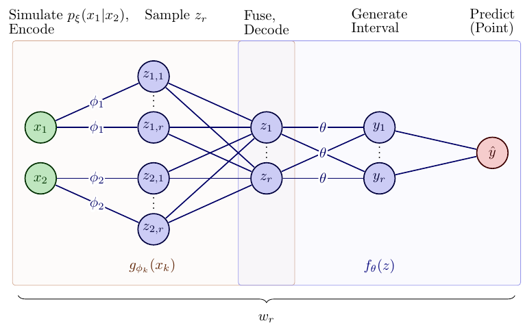

# SEMF: Supervised Expectation-Maximization Framework for Predicting Intervals

<p align="center">
  
</p>

## Requirements

1. Ensure Python 3.12.0 is installed on your system.

2. Create and activate a virtual environment using conda:

conda:
```bash
conda create --name semf_env python=3.12.0
conda activate semf_env
```

then install dependencies:
```bash
pip install -r requirements.txt
```
Note that by default, `requirements.txt` installs the GPU version of `torch` , if you do not have a GPU, comment the line with `--find-links ` in `requirements.txt` which installs the CPU version of `torch` and `torchvision` instead.**We recommend using conda for installing cuda and cudnn for GPU support if you do not already have the cuda toolkit using the following *(run before installation the requirements)***
<!-- ```bash
conda install -c conda-forge cudatoolkit=11.2 cudnn=8.1.0
``` -->

Finally, to run the tests and make sure everything is working, execute the following command from the root directory of the repository:
```bash
pytest
```

## Training and Evaluation

For running the experiments on the real datasets, use `src/experiments/real/run_experiments.py` with wandb integration. This script acts as `train.py` and `evaluate.py` scripts found in most ML papers. The environment has been tested on both Windows (11) and Linux (Ubuntu 22.04.4 LTS), with a note that results may vary between different OS. When using wandb, results may be viewed directly on the wandb platform, including benchmark comparisons.

To run experiments and evaluate results on wandb, navigate to `src/experiments/real` and execute the scripts as per your experimental setup and explained in the project structure below. You can re-run the training and the sweeps using wandb:

1. Copy / clone this repo on the different machines / clusters you want to use.
2. Login to WandB and add your wandb username and project id to `src/experiments/real/.env` 
3. Move into `src/experiments/real` and run `python run_experiments.py`.
4. You can run each sweep by running `wandb agent <USERNAME/PROJECTNAME/SWEEPID>. More infos [in the wandb doc](https://docs.wandb.ai/guides/sweeps) . Specify the count as well (in our case, 500).

### Important Notes for Replication
The experiments were conducted on a machine with the following specifications:

- Operating System: Microsoft Windows 11 Home, Version 10.0.22631
- Processor: 13th Gen Intel(R) Core(TM) i9-13900KF
- RAM: 32 GB
- GPU: NVIDIA GeForce RTX 4090
- Python Version: 3.12.0
- CUDA Version: 12.7
- Dependencies: As listed in requirements.txt

It is not required to have GPU, nor use multiple cores as in our case, however, please note that the performance can be slower. Additionally, with the random seed and the use of parallelization with `joblib`, the performance may vary slightly on other operating systems due to differences in computational handling or specific library implementations.

We would also like to point out that for `MultiET`'s model, the SEMF results may vary but should fall within the range provided in the paper when choosing `parallel_type="semf_joblib"` and `n_jobs>1`, even across different runs for the same seed and on the same machine. The only way to get the same results is to not parallelize and run the program on a single core, which can significantly slow down the training process. See this issue for this topic: https://github.com/scikit-learn/scikit-learn/issues/22303 . For `MultiXGBs` and `MultiMLPs` models,  under the same setting, the results will be the same every time, if not very similar.

## Directory Structure 

```md
semf_unzipped/
├── pytest.ini
├── README.md
├── requirements.txt
├── semf-tikz-plot.png
├── .gitignore
├── data/
│   └── tabular_benchmark/
│       ├── .
├── results/
│   ├── sweep_hyperparams_final.csv
│   ├── synthetic_experiments_results_cosine_x2.json
│   ├── synthetic_experiments_results_quadratic_x2.json
│   └── sweep_results.csv
└── src/
    ├── demo.py
    ├── tests/
    │   ├── test_visualize.py
    │   ├── test_semf.py
    │   ├── test_utils.py
    │   ├── test_preprocessing.py
    │   └── test_models.py
    ├── semf/
    │   ├── semf.py
    │   ├── visualize.py
    │   ├── utils.py
    │   ├── preprocessing.py
    │   └── models.py
    └── experiments/
        ├── real/
        │   ├── process_sweep_wandb.py
        │   ├── run_experiments.py
        │   ├── config_sweeps_multimlps.yml
        │   ├── config_sweeps_multixgbs_multiets.yml
        │   ├── evaluate_results.py
        │   ├── fetch_sweep_wandb.py
        │   ├── .env
        ├── shared/
        │   ├── benchmark.py
        │   ├── cmd_configs.py
        └── synthetic/
            ├── synthetic_data_generator.py
            ├── synthetic_experiments.py
            └── plot_synthetic_intervals.py
```

- `data/`: Contains the datasets used in our experiments. These are automatically generated once you run the experiment scripts within `src/experiments/`. 
- `results/`: Stores the results of all parameter sweeps and hyperparameter configurations.
- `sweep_hyperparams_final.csv` : Contains the hyperparameters used in the final model.
- `sweep_results_complete.csv` : Contains the raw results of the SEMF model.
- `sweep_results.csv` : Contains the results of the final model with the conformalized intervals.
- `src/`: The source code required to replicate our experiments, including model training and evaluation scripts. 
- `demo.py`: An example script to demonstrate the usage of the SEMF model.
- `tests/` : Contains tests for the main SEMF algorithm.
- `preprocessing.py` : Contains the preprocessing functions for the data used in the experiments.
- `semf/` : Contains the main semf modules.
- `models.py` : Contains the models used within SEMF ("MultiXGBs", "MultiMLPs", "MultiETS") as well as "QNN" for benchmarking.
- `semf.py` : Contains the SEMF class that does the trianing and inference for both points and intervals.
- `visualize.py` : Visualization functions.
- `utils.py` : Utility functions.
- `experiments/` : Contains the scripts for running the experiments.
- `real/` : Contains the scripts for running the experiments on WANDB.
- `.env` : Contains the WANDB entity and project name that is used by all `real` scripts and sweeps.
- `run_experiments.py` : Main for running the experiments locally that is used for argparser (corresponds to `train.py` and `evaluate.py` found in most ML papers).
- `evaluate_results.py`: Evaluates the results of the best hyperparameters from `sweep_hyperparams_final.csv`.
- `process_sweep_wandb.py` : Processes the results of the experiments and saves them to the `./results` folder according to both the criteria in the paper and in the description in the script. Ensure that you specify your WANDB entity and project name here.
- `fetch_sweep_wandb.py` : Fetch all the runs for the sweep or final results save them to the `./results` folder.
- `config_sweeps_multimlps.yml` : Contains the hyperparameters for the WANDB sweep for the MultiMLPs model.
- `config_sweeps_multixgbs_multiets.yml`: Contains the hyperparameters for the WANDB sweep for the MultiXGBs and MultiETS models.
- `shared/` : Contains the shared scripts for both WANDB and local experiments.
- `benchmark.py` : Benchmarking class for SEMF.
- `cmd_configs.py` : Argument parsing for customizable experiment runs.
- `synthetic/` : Contains the scripts for running the synthetic experiments.
- `synthetic_data_generator.py` : Generates simulated data that is used both by the `demo.py` and `synthetic_experiments.py`.
- `synthetic_experiments.py` : Main for running the synthetic experiments.
- `plot_synthetic_intervals.py` : Plots the results of the synthetic data (Figure 2 in the paper).


## Contributing
This repository is released under the MIT License. If you want to contribute to this project, please follow these steps:

1. Fork the repository. 
2. Create a new branch (`git checkout -b feature-foo`). 
3. Commit your changes (`git commit -am 'Add some foo'`). 
4. Push to the branch (`git push origin feature-foo`).
5. Create a new Pull Request.
